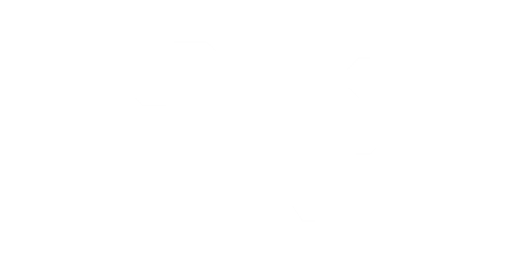
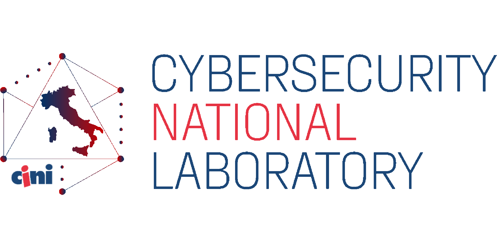
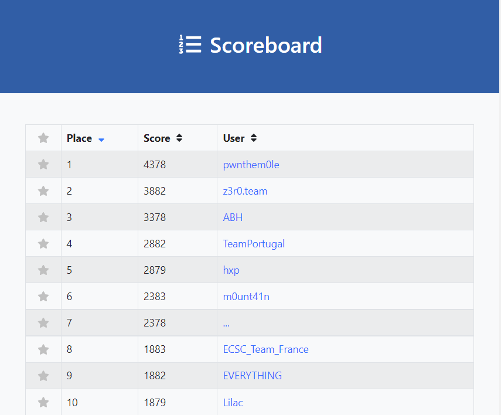

# TeamItalyCTF 2022

TeamItaly CTF 2022 is the first edition of the online Jeopardy-style Capture-The-Flag competition hosted by the members of [TeamItaly](https://teamitaly.eu/), the Italian national cybersecurity team, supported by the italian [Cybersecurity National Laboratory](https://cybersecnatlab.it/) participating in the [European Cyber Security Challenge (ECSC)](https://ecsc.eu/) by [ENISA](https://www.enisa.europa.eu/).

- [CTFtime event](https://ctftime.org/event/1730)
- [CTF Platform](https://ctf.teamitaly.eu/)

   

## Challenges

|   # | Category | Challenge                                 | Author                                                        | Solves | Protocol |                                 Url |  Port |
| --: | :------- | :---------------------------------------- | :------------------------------------------------------------ | -----: | -------: | ----------------------------------: | ----: |
|   1 | Misc     | [Family business](FamilyBusiness/)        | [Luigi Loffredo](https://github.com/LL3006)                   |      1 |          |                                     |       |
|   2 | Misc     | [ImageStore](ImageStore/)                 | [Antonio Napolitano](https://github.com/napaalm)              |     10 |      tcp |      imagestore.challs.teamitaly.eu | 15000 |
|   3 | Misc     | [ImageStore2](ImageStore2/)               | [Antonio Napolitano](https://github.com/napaalm)              |      2 |      tcp |     imagestore2.challs.teamitaly.eu | 15013 |
|   4 | Web      | [Schei Checker](ScheiChecker/)            | [Jacopo Di Pumpo](https://github.com/ShiSHcat)                |      6 |     http |   schei-checker.challs.teamitaly.eu | 15001 |
|   5 | Web      | [Flag proxy](FlagProxy/)                  | [Giovanni Minotti](https://github.com/Giotino)                |     41 |     http |      flag-proxy.challs.teamitaly.eu | 15002 |
|   6 | Web      | [Red Saffron](RedSaffron/)                | [Stefano Alberto](https://github.com/xatophi)                 |      1 |     http |         saffron.challs.teamitaly.eu | 15003 |
|   7 | Crypto   | [Lazy platform](LazyPlatform/)            | [Mattia Lorenzo Chiabrando](https://github.com/mattiabrandon) |     70 |      tcp |   lazy-platform.challs.teamitaly.eu | 15004 |
|   8 | Crypto   | [The missing half](TheMissingHalf/)       | [Elia Cal](https://github.com/EliusSolis)                     |     17 |          |                                     |       |
|   9 | Crypto   | [GPOCS](GPOCS/)                           | [Kien Tuong Truong](https://github.com/kientuong114)          |      8 |      tcp |           gpocs.challs.teamitaly.eu | 15005 |
|  10 | Crypto   | [Elliptic Pizza](EllipticPizza/)          | [Lorenzo Demeio](https://github.com/Devrar)                   |      2 |      tcp |  elliptic-pizza.challs.teamitaly.eu | 15012 |
|  11 | Rev      | [Alice's Adventures in Goland](Goland/)   | [Simone Petroni](https://github.com/timetravelthree)          |      2 |      tcp | alice-in-goland.challs.teamitaly.eu | 15006 |
|  12 | Rev      | [Speaking with hands](SpeakingWithHands/) | [Matteo Schiff](https://github.com/Matte23)                   |      7 |          |                                     |       |
|  13 | Rev      | [Spaghetti VM](SpaghettiVM/)              | [Gianluca Altomani](https://github.com/devgianlu)             |      8 |          |                                     |       |
|  14 | Rev      | [Ik1VM - CrackmeEVA](CrackmeEVA/)         | [Armando Bellante](https://github.com/ikiga1)                 |      1 |          |                                     |       |
|  15 | Pwn      | [kreap](kreap/)                           | [Carlo Collodel](https://github.com/collodel)                 |      0 |      tcp |           kreap.challs.teamitaly.eu | 15007 |
|  16 | Pwn      | [Safe Pizza Orders](SafePizzaOrders/)     | [Domingo Dirutigliano](https://github.com/DomySh)             |      4 |      tcp |    pizza-orders.challs.teamitaly.eu | 15008 |
|  17 | Pwn      | [Mario's Metaverse Marketplace](MMM/)     | [Mario del Gaudio](https://github.com/athdesk)                |      1 |      tcp |             mmm.challs.teamitaly.eu | 15009 |
|  18 | Pwn      | [Atomic Pizza](AtomicPizza/)              | [Marco Meinardi](https://github.com/MarcoMeinardi)            |      1 |      tcp |    atomic-pizza.challs.teamitaly.eu | 15010 |
|  19 | Pwn      | [FamilyRecipes](FamilyRecipes/)           | [Giulia Martino](https://github.com/giuliamartino)            |      1 |      tcp |   familyrecipes.challs.teamitaly.eu | 15011 |

## Final scoreboard

### Top 10

### Full scoreboard

- [Archived online scoreboard](https://web.archive.org/web/20220908153239/https://ctf.teamitaly.eu/scoreboard)
- [Full scoreboard](images/scoreboard.png)
- [Solves](images/solves.png)

### Data export

- [Scoreboard feed (CTFTime format)](data/scoreboard.json)
- [Scoreboard feed (csv)](data/scoreboard.csv)
- [Correct submissions (csv)](data/submissions.csv)
